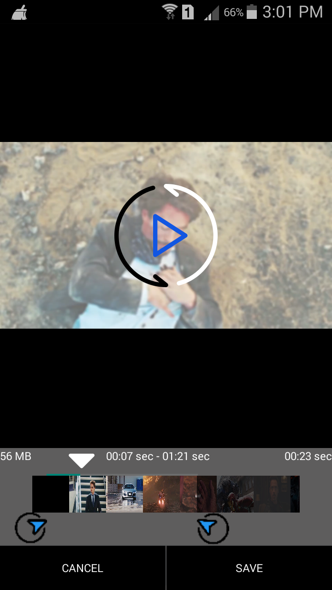

# FastestVideoTrimmer

The Fastest Android Java Video Trimmer/Cropper Library for Android.

<h2>VideoTrimmer Layout</h3>

   

<h3> GET REFRENCE CODE AND START WORKING VIDEOTRIMMER --> <a href="/app/src/main/java/com/rizwan/fastestvideotrimmer/VideoCropping.java"> VIDEOTRIMMERCODE </a></h3>
   
   
   
   
   
   

Only five steps to use the FastestVideoTrimmer:

1. Add repository to your build file.

       allprojects {
      		repositories {
		   	...
	   		maven { url 'https://jitpack.io' }
		   }
	   }

2. Add the dependency.

       dependencies {
	              implementation 'com.github.sayyedrizwan:FastestVideoTrimmer:2.0'
	               		}

3. Add VideoTrimmer Layout
	
	
		<com.rizwan.videocropper.interfaces.interfaces.videoCropper xmlns:android="http://schemas.android.com/apk/res/android"
    			xmlns:app="http://schemas.android.com/apk/res-auto"
    			xmlns:tools="http://schemas.android.com/tools"
    			android:id="@+id/croppingactivity"
    			android:layout_width="match_parent"
    			android:layout_height="match_parent"/>

4. implement OnTrimVideoListener, OnCropVideoListener on your working Activity and implement all methods

		
		
  	  @Override
   	 public void onVideoPrepared() {
   	 }

   	 @Override
    	public void onTrimStarted() {
        }

   	 @Override
   	 public void getResult(final Uri uri) {
    	}

    	@Override
   	 public void cancelAction() {
    	}

    	@Override
    	public void onError(final String message) {
    	}

	    @Override
    	public void onPointerCaptureChanged(boolean hasCapture) {
    	}

5. Set actions to work with videotrimmer as per your Requirment

	
            videoCropper.setMaxDuration(204); //3.40 Min //setMaximum duration
            videoCropper.setOnTrimVideoListener(this);
            videoCropper.setOnK4LVideoListener(this);
            videoCropper.setDestinationPath("/storage/emulated/0/Download"); //custom path = /storage/emulated/0/
            videoCropper.setVideoURI(Uri.parse(helper.Path)); // Video Path
            videoCropper.setVideoInformationVisibility(true); // Visible User Information //Defualt is false
	    
	    
	   

License

		Copyright 2018-2019 Wallpo Inc.

	Licensed under the Apache License, Version 2.0 (the "License");
	you may not use this file except in compliance with the License.
	You may obtain a copy of the License at

   	http://www.apache.org/licenses/LICENSE-2.0

	Unless required by applicable law or agreed to in writing, software
	distributed under the License is distributed on an "AS IS" BASIS,
	WITHOUT WARRANTIES OR CONDITIONS OF ANY KIND, either express or implied.
	See the License for the specific language governing permissions and
	limitations under the License.
	
	
	
	
	
	
	
	
Founder Rizwan Sayyed
